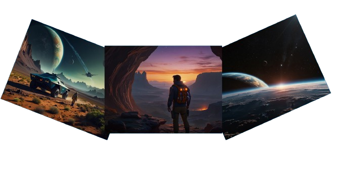

# A Jornada do Explorador: Mistérios de um Planeta Desconhecido 

## 📒 Descrição
Essa simples historia, conta sobre um explorador, que vaga pelo universo buscando planetas e descobertas.

## 🤖 Tecnologias Utilizadas
- [Leonardo AI](https://app.leonardo.ai/) 
- [ChatGPT](https://chatgpt.com/)
- [Capcut](https://www.capcut.com/)
- [Clipchamp](https://clipchamp.com/)

## 🧐 Processo de Criação
As imagens utilizadas no vídeo foram geradas no **Leonardo AI**, o roteiro da historia foi criado no **ChatGPT**, a organização das imagens e os efeitos foram no **Capcut**,  a narração da voz do narrador e do explorador, foi gerado no **Clipchamp**.

## 🚀 Resultados
<a href="https://github.com/SergioSinhoca/lab-natty-or-not/tree/main/video"
 title="View PDF now"> Clique aqui e confira o vídeo</a>

